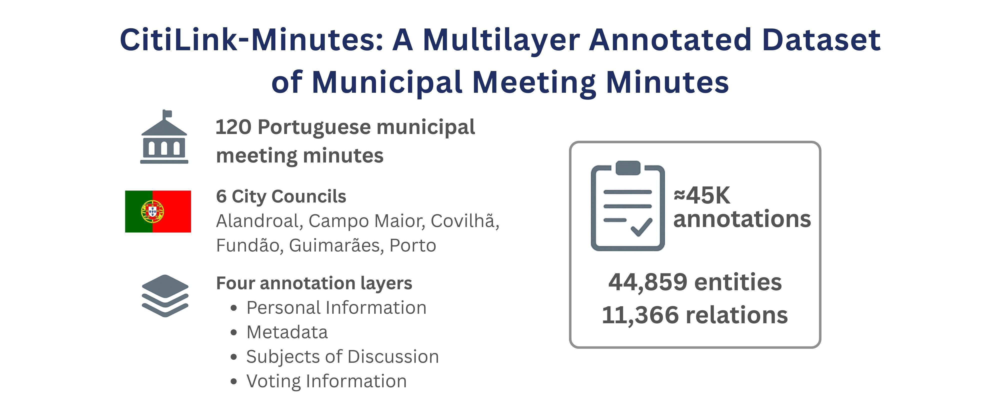
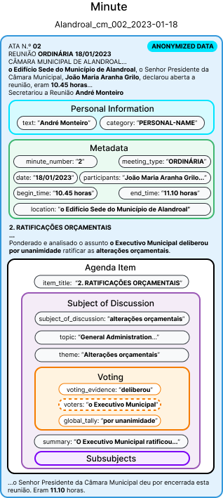
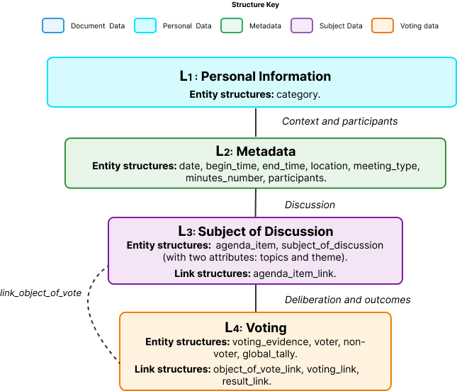

# CitiLink-Minutes: A Multilayer Annotated Dataset of Municipal Meeting Minutes

[](https://creativecommons.org/licenses/by-nc-nd/4.0/)
[](https://doi.org/10.1007/978-3-032-21321-1_56)
[](https://doi.org/10.25747/7KG6-1K22)
[](https://dataset.citilink.inesctec.pt)
[](https://citilink.inesctec.pt)

Official repository for CitiLink-Minutes, a multilayer annotated dataset of municipal meeting minutes. It provides structured annotations for metadata, discussion topics, and voting outcomes, supporting research in NLP and Information Retrieval.

> 📦 **Version Note**  
> This repository contains the **most up-to-date version** of the _CitiLink-Minutes_ dataset, introduced in the paper  
> **"CitiLink-Minutes: A Multilayer Annotated Dataset of Municipal Meeting Minutes"**.  
> The version associated with the ECIR'26 submission (v1.0.0) is available [here](https://github.com/INESCTEC/citilink-dataset/releases/tag/v1.0.0). All available releases can be found [here](https://github.com/INESCTEC/citilink-dataset/releases).

**[Try our interactive Dataset Explorer](https://dataset.citilink.inesctec.pt)**
(The Dataset Explorer is password-protected. To access the platform, please visit this [link](https://doi.org/10.25747/7KG6-1K22) and request access to the dataset.)

<div align="center">
  
</div>

## Description

The CitiLink-Minutes dataset is a comprehensive collection of Portuguese municipal council meeting minutes, providing structured and annotated data from local government proceedings. This dataset contains **over 1.3 million tokens** with comprehensive multilayer annotations covering (1) **personal information**, (2) **metadata**, (3) **subjects of discussion**, and (4) **voting outcomes**, totaling **44,859 entities** and **11,366 relations** across six Portuguese municipalities.

**What this project does:**
This dataset provides researchers, data scientists, and civic tech developers with access to structured municipal governance data, enabling analysis of local government decision-making, voting patterns, policy discussions, and civic participation across different Portuguese municipalities.

**Who it is for:**

- Researchers studying local governance and public administration
- Data scientists working on natural language processing and text mining
- Civic tech developers building transparency and accountability tools
- Political scientists analyzing voting behavior and policy trends
- Journalists investigating municipal government activities

**The problem it solves:**
Municipal meeting minutes are typically published as unstructured PDF or text documents, making it difficult to extract insights, perform comparative analysis, or track specific topics across time and municipalities. This dataset transforms these documents into a structured, queryable format with rich metadata and annotations, including participant information, voting records, agenda items, discussion themes, and temporal data.

## Project Status

This project is currently **completed and stable**. The dataset represents a snapshot of municipal meeting minutes from the covered municipalities. Updates may be released periodically to include additional meetings or municipalities.

## Dataset Statistics

- **Full Dataset**: The full dataset statistics are shown below. The full dataset is available via the dataset DOI (https://doi.org/10.25747/7KG6-1K22), subject to a Data Use Agreement.
- **Sample Data**: This repository only includes a sample of **6 annotated documents** for demonstration purposes.
- **Dataset Explorer**: To explore the full dataset, please visit our **[Dataset Explorer](https://dataset.citilink.inesctec.pt)** (The Dataset Explorer is password-protected. To access the platform, please visit this [link](https://doi.org/10.25747/7KG6-1K22) and request access to the dataset.)

| **Municipality** | **Tokens**    | **Entities** | **Relations** |
| ---------------- | ------------- | ------------ | ------------- |
| Alandroal        | 59,669        | 5,033        | 1,532         |
| Campo Maior      | 155,436       | 7,130        | 1,905         |
| Covilhã          | 298,496       | 11,922       | 2,809         |
| Fundão           | 324,036       | 6,379        | 1,074         |
| Guimarães        | 235,104       | 7,790        | 1,821         |
| Porto            | 305,594       | 6,605        | 2,225         |
| **Total**        | **1,378,335** | **44,859**   | **11,366**    |

**Key Metrics:**

- **Tokens**: Total number of words/tokens in meeting minutes
- **Entities**: Annotated entities (participants, dates, locations, organizations, etc.)
- **Relations**: Annotated relationships between entities (voting records, participations, etc.)

## Dataset Structure

<table align="center">
  <tr>
    <td align="center" style="padding-right:12px;">
      
    </td>
    <td align="center" style="padding-left:12px;">
      
    </td>
  </tr>
</table>

The dataset is organized into 6 JSON files, one per municipality:

```
data/
├── Alandroal.json
├── Campomaior.json
├── Covilha.json
├── Fundao.json
├── Guimaraes.json
└── Porto.json
```

### JSON Schema

Each JSON file follows this hierarchical structure:

```json
{
  "municipalities": [
    {
      "municipality": "string",           // Municipality name
      "minutes": [
        {
          "minute_id": "string",        // Unique identifier (format: Municipality_cm_XXX_YYYY-MM-DD)
          "full_text": "string",          // Complete meeting minutes text
          "personal_info": [
            {
              "category": "string",        // Category of personal info (e.g., "PERSONAL-NAME")
              "text": "string",
              "start": number,
              "end": number
            }
          ],
          "metadata": {
            "municipality": "string",
            "year": "string",
            "minute_number": {
              "text": "string",
              "start": number,            // Character offset in full_text
              "end": number
            },
            "date": {
              "text": "string",
              "start": number,
              "end": number
            },
            "location": {
              "text": "string",
              "start": number,
              "end": number
            },
            "meeting_type": {
              "text": "string",
              "start": number,
              "end": number,
              "type": "string"           // e.g., "ordinary", "extraordinary"
            },
            "begin_time": {
              "text": "string",
              "start": number,
              "end": number
            },
            "end_time": {
              "text": "string",
              "start": number,
              "end": number
            },
            "participants": [
              {
                "name": "string",
                "type": "string",         // e.g., "president", "vice_president", "councilors", "staff"
                "start": number,
                "end": number,
                "party": "string",        // Political party affiliation
                "present": "string"       // "present" or "absent"
              }
            ]
          },
          "agenda_items": [
            {
              "item_id": number,          // Sequential agenda item number
              "item_title": "string",     // Agenda item title
              "subjects": [
                {
                  "subject_id": "string",
                  "text": "string",       // Discussion text
                  "start": number,
                  "end": number,
                  "subject": {
                    "text": "string",
                    "start": number,
                    "end": number
                  },
                  "summary": "string",       // Brief summary of the subject
                  "voting": [
                    {
                      "voters": {
                        "in_favor": [
                          {
                            "text": "string",
                            "start": number,
                            "end": number
                          }
                        ],
                        "against": [],
                        "abstention": [],
                        "blank": []         // Blank/invalid votes (omitted if empty)
                      },
                      "non_voters": [],
                      "global_tally": {
                        "text": "string",
                        "start": number,
                        "end": number,
                        "type": "string"  // e.g., "unanimous", "majority"
                      },
                      "voting_evidence": {
                        "text": "string",
                        "start": number,
                        "end": number
                      }
                    }
                  ],
                  "theme": "string",      // Subject theme
                  "topics": [             // Categorized topics
                    "string"
                  ],
                  "sub_subjects": [       // Sub-subjects within the main subject (omitted if empty)
                    {
                      "text": "string",
                      "start": number,
                      "end": number,
                      "theme": "string",
                      "voting": [          // Voting records for this sub-subject
                        {
                          "voters": {
                            "in_favor": [],
                            "against": [],
                            "abstention": [],
                            "blank": []
                          },
                          "non_voters": [],
                          "global_tally": {
                            "text": "string",
                            "start": number,
                            "end": number,
                            "type": "string"
                          },
                          "voting_evidence": {
                            "text": "string",
                            "start": number,
                            "end": number
                          },
                          "vote_type": {
                            "text": "string",  // Type of voting (e.g., "escrutínio secreto")
                            "start": number,
                            "end": number
                          }
                        }
                      ]
                    }
                  ]
                }
              ]
            }
          ]
        }
      ]
    }
  ]
}
```

### Data Format

The CitiLink-Minutes dataset is provided in JSON format.

| **Field**         | **Description**                                                                                                               |
| ----------------- | ----------------------------------------------------------------------------------------------------------------------------- |
| `municipality`    | Name of the municipality (e.g., "Alandroal", "Porto")                                                                         |
| `minute_id`       | Unique identifier for each meeting minute (format: `Municipality_cm_XXX_YYYY-MM-DD`)                                          |
| `full_text`       | Complete text of the meeting minutes. Format: utf-8, not tokenized, includes newlines                                         |
| `personal_info`   | List of anonymised personal information identifiers with category classification                                              |
| `category`        | Category of personal information (e.g., `PERSONAL-NAME`, `PERSONAL-ADDRESS`, `PERSONAL-PUBLIC`)                               |
| `metadata`        | Structured metadata containing meeting information (date, location, participants, etc.)                                       |
| `year`            | Year of the meeting                                                                                                           |
| `minute_number`   | Official minute number with character offsets in `full_text`                                                                  |
| `date`            | Meeting date with character offsets                                                                                           |
| `location`        | Meeting location with character offsets                                                                                       |
| `meeting_type`    | Type of meeting (e.g., "ordinary", "extraordinary") with character offsets                                                    |
| `begin_time`      | Meeting start time with character offsets                                                                                     |
| `end_time`        | Meeting end time with character offsets                                                                                       |
| `participants`    | List of meeting participants with roles, party affiliations, and attendance status                                            |
| `name`            | Participant name                                                                                                              |
| `type`            | Participant role (e.g., "president", "vice_president", "councilors", "staff")                                                 |
| `party`           | Political party affiliation                                                                                                   |
| `present`         | Attendance status ("present" or "absent")                                                                                     |
| `start`           | Begin offset in the document. Format: number of characters starting at 0. Newlines and escaped symbols count as one character |
| `end`             | End offset in the document. Format: number of characters                                                                      |
| `agenda_items`    | List of agenda items discussed in the meeting                                                                                 |
| `item_id`         | Sequential agenda item number                                                                                                 |
| `item_title`      | Title of the agenda item                                                                                                      |
| `subjects`        | List of discussion subjects within an agenda item                                                                             |
| `subject_id`      | Unique identifier for the subject                                                                                             |
| `text`            | Full text of the subject discussion                                                                                           |
| `subject`         | Key point of the subject with character offsets                                                                               |
| `summary`         | Brief summary of the subject                                                                                                  |
| `voting`          | List of voting records for the subject                                                                                        |
| `voters`          | Structured voting information (in_favor, against, abstention)                                                                 |
| `in_favor`        | List of voters who voted in favor (can be an empty annotation when the voter isn't linguistically expressed in the text)      |
| `against`         | List of voters who voted against                                                                                              |
| `abstention`      | List of voters who abstained                                                                                                  |
| `blank`           | List of voters with blank or invalid votes (optional field in voters, omitted if empty)                                       |
| `non_voters`      | List of participants who did not vote                                                                                         |
| `global_tally`    | Overall voting result with character offsets                                                                                  |
| `type`            | Result type (e.g., "unanimous", "majority")                                                                                   |
| `voting_evidence` | Textual evidence of the voting outcome with character offsets                                                                 |
| `theme`           | Subject theme                                                                                                                 |
| `topics`          | List of categorized topics for the subject                                                                                    |
| `sub_subjects`    | Sub-subjects within the main subject discussion (optional field, omitted if empty)                                            |
| `vote_type`       | Type of voting procedure (e.g., "escrutínio secreto" for secret ballot)                                                       |

**Note:** Character offsets (`start` and `end`) reference positions in the `full_text` field, enabling precise text extraction and span-based annotations.

### Data Anonymization

**Important:** Personal identifiable information (PII) has been anonymized to protect privacy. The anonymization process involves replacing the original text spans with **synthetic (fake) text spans** that match the respective annotation category.

- **Private Individuals & Staff:** Names, addresses, and other identifiers of private citizens and municipal staff have been replaced with realistic synthetic data.
- **Public Figures:** Political figures holding public office (e.g., mayors, councilors) are **not anonymized** as they are public figures.
- **Public Information:** Entities such as municipalities, dates, and official document names (e.g., `PERSONAL-PUBLIC`, `PERSONAL-ADMIN`) are preserved or use realistic patterns.

The dataset includes the following personal information categories:

| Category            | Description                                                                |
| ------------------- | -------------------------------------------------------------------------- |
| `PERSONAL-NAME`     | Synthetic personal names                                                   |
| `PERSONAL-ADDRESS`  | Synthetic address information                                              |
| `PERSONAL-ADMIN`    | Synthetic administrative identifiers (e.g., process numbers)               |
| `PERSONAL-COMPANY`  | Synthetic company/organization names                                       |
| `PERSONAL-POSITION` | Synthetic professional positions/titles                                    |
| `PERSONAL-PUBLIC`   | **Non-anonymized** public information (public figures, entity names, etc.) |
| `PERSONAL-OTHER`    | Other synthetic or preserved identifiers (e.g., dates, locations)          |

> [!NOTE]
> Character offsets (`start` and `end`) reference the positions of these synthetic spans in the `full_text` field.

### Annotation Guidelines

Detailed annotation instructions, including the annotation procedures, quality control measures, and complete schema definitions are available in the [Annotation Guidelines](docs/citilink_annotation_guidelines.pdf). This guide provides comprehensive information about:

- The annotation process and methodology
- Inter-annotator agreement protocols
- Guidelines for identifying and labeling metadata, participants, voting records, and topics
- Quality assurance procedures
- Schema definitions for all data fields

Researchers and users interested in understanding the dataset structure in depth or replicating the annotation process should consult this document.

## Data Access

### Sample Dataset

A **sample dataset** is available in the `sample_data/` folder, containing one municipal meeting minute per municipality (6 total documents).

### Full Dataset

The complete dataset (120 municipal meeting minutes across 6 municipalities) is protected by a Data Use Agreement and is available via the following DOI:

**DOI:** [https://doi.org/10.25747/7KG6-1K22](https://doi.org/10.25747/7KG6-1K22)

The dataset contains 20 minutes per municipality, totaling over 1.3 million tokens, 44,859 entities, and 11,366 relations. Please visit the DOI link to access the full dataset and review the usage terms.

## Usage

### Dataset Subsets

To facilitate different use cases and reduce data processing overhead, the dataset includes four specialized subsets available in the `data/subsets/` directory:

```
data/subsets/
├── metadata/
├── subjects_of_discussion/
├── voting/
└── personal_info/
```

Each folder contains one JSON file per municipality:
`Alandroal.json`, `Campomaior.json`, `Covilha.json`, `Fundao.json`, `Guimaraes.json`, `Porto.json`.

#### Subset Descriptions

1. **`metadata`** - Contains only metadata annotations
   - Includes: participants, dates, locations, meeting types, times, full_text
   - Excludes: agenda items, subjects, voting records
   - Use case: Analyzing meeting patterns, participant attendance, temporal trends

2. **`subjects_of_discussion`** - Contains core subject annotations
   - Includes: subject_id, start, end, subject, summary, theme, topics
   - Excludes: full text, metadata, voting records
   - Use case: Topic classification, Topic Segmentation, QA systems

3. **`voting`** - Contains complete subject annotations
   - Includes: all subject fields including voting records and full_text
   - Excludes: metadata
   - Use case: Voting pattern analysis, decision-making research, subject-focused analysis

4. **`personal_info`** - Contains only personal information annotations
   - Includes: minute_id, full_text, personal_info (with type classification)
   - Excludes: metadata, agenda items, subjects, voting records
   - Use case: PII detection, anonymization analysis, privacy research

**Benefits:**

- Reduced file sizes (30-80% smaller depending on subset)
- Faster loading and processing times
- Focus on specific annotation layers for targeted analysis
- Maintains original dataset structure for compatibility

### Dataset Split

The dataset includes a **temporal train/validation/test split** designed to simulate real-world deployment scenarios. Documents were ordered chronologically and divided into:

- **Training set**: 60% (72 documents) - Earlier minutes
- **Validation set**: 20% (24 documents) - Middle period
- **Test set**: 20% (24 documents) - Most recent minutes

This temporal split ensures that the most recent minutes are reserved for testing, enabling realistic evaluation of model performance on future data. The split information is available in `data/split_info.json`.

**Loading the split:**

```python
import json

# Load split information
with open('data/split_info.json', 'r') as f:
    split_info = json.load(f)

print(f"Train: {split_info['train_count']} documents")
print(f"Val: {split_info['val_count']} documents")
print(f"Test: {split_info['test_count']} documents")

# Example: Load training data
train_files = split_info['train_files']
# Use these filenames to filter your dataset
```

### Loading the Data

**Python:**

```python
import json

# Load a municipality's data
with open('data/Alandroal.json', 'r', encoding='utf-8') as f:
    alandroal_data = json.load(f)

# Access documents
documents = alandroal_data['municipalities'][0]['minutes']

# Or load a subset
with open('data/subsets/subjects_of_discussion/Alandroal.json', 'r', encoding='utf-8') as f:
    subjects_data = json.load(f)
```

### Query Examples

Here are practical examples of what you can extract from this dataset using Python:

#### 1. Get all meeting dates from a municipality

```python
import json

with open('data/Alandroal.json', 'r', encoding='utf-8') as f:
    data = json.load(f)

dates = [doc['metadata']['date']['text']
         for doc in data['municipalities'][0]['minutes']]
print(dates)  # ['18/01/2023', '28/09/2022', ...]
```

#### 2. Get all participants who attended meetings

```python
attendees = []
for doc in data['municipalities'][0]['minutes']:
    for participant in doc['metadata']['participants']:
        if participant['present'] == 'present':
            attendees.append(participant['name'])

# Get unique attendees
unique_attendees = list(set(attendees))
```

#### 3. Get all agenda item titles from all meetings

```python
agenda_titles = []
for doc in data['municipalities'][0]['minutes']:
    for item in doc['agenda_items']:
        agenda_titles.append(item['item_title'])
```

#### 4. Find all unanimous voting decisions

```python
unanimous_votes = []
for doc in data['municipalities'][0]['minutes']:
    for item in doc['agenda_items']:
        for subject in item['subjects']:
            for vote in subject.get('voting', []):
                if vote['global_tally']['type'] == 'unanimous':
                    unanimous_votes.append({
                        'minute_id': doc['minute_id'],
                        'subject': subject.get('theme', ''),
                        'vote': vote
                    })
```

#### 5. Get all subjects discussed on a specific topic (e.g., "Environment")

```python
environment_subjects = []
for doc in data['municipalities'][0]['minutes']:
    for item in doc['agenda_items']:
        for subject in item['subjects']:
            if 'Environment' in subject.get('topics', []):
                environment_subjects.append({
                    'minute_id': doc['minute_id'],
                    'theme': subject['theme'],
                    'text': subject['text']
                })
```

### Dataset Conversion

The `scripts/` folder contains Python scripts to convert the dataset into alternative formats suitable for training NLP models:

1. **Metadata to BIO (Token Classification)**: [`convert_metadata_to_spans.py`](scripts/convert_metadata_to_spans.py) transforms metadata annotations into BIO-tagged JSONL format for Named Entity Recognition (NER) tasks.
2. **Voting to JSONL spans**: [`convert_voting_to_spans.py`](scripts/convert_voting_to_spans.py) converts voting annotations into a span-based JSONL format. This script handles complex scenarios such as multi-vote subjects and secret ballots, providing subject-relative offsets.

**Usage Examples:**

```bash
# Convert metadata to BIO format
python scripts/convert_metadata_to_spans.py --input_dir data/ --output_dir data/metadata_bio

# Convert voting to span-annotated format
python scripts/convert_voting_to_spans.py --input data/ --output-dir data/voting_spans
```

## Baselines

The associated research paper establishes baseline performance for three key tasks using this dataset. Metadata and Voting Identification tasks were evaluated using both **encoder-based models** and **LLM-based approaches** with Gemini 2.5 Pro, while Topic Classification employs a **Gradient Boosting ensemble with Active Learning**.

**Fine-tuned Models:** All fine-tuned BERTimbau models for the tasks described below are publicly available in [HuggingFace](https://huggingface.co/collections/liaad/citilink-68f7916f31b9588c4fe2f43b).

### 1. Metadata Identification

Extracting structured metadata from meeting minutes, including participants, dates, locations, meeting types, and temporal information.

**Approaches:**

- **Encoder**: [Portuguese BERT (BERTimbau)](https://huggingface.co/neuralmind/bert-base-portuguese-cased) fine-tuned for token classification
- **LLM**: Gemini 2.5 Pro with structured extraction prompts

**Example Prompt** (Metadata Extraction):

```
Task: Extract metadata from Portuguese municipal minutes using the text provided.

Metadata to be extracted (classes):
- minute_id: minute number (exact text appearing as ‘MINUTES No. <n>’).
- date: date of the meeting (original format as it appears in the text, e.g.: ‘17 NOVEMBER 2021’).
- meeting_type: type of meeting (e.g.: ‘ORDINARY’, ‘EXTRAORDINARY’).
- location: venue where the meeting takes place (exact text, including determiners or prepositions, e.g.: ‘at the Town Hall’).
- begin_time: start time (exact text, e.g.: ‘nine thirty’ or ‘10.35 am’).
- end_time: end time (exact text, e.g. ‘ten fifty’ or ‘16:00’).
- participant: participant named at the start, with attributes:
    - type: one of {‘chairperson’, ‘councillors’} (do not invent new categories)
    - present: ‘present’|‘absent’|“substituted” where clearly indicated (e.g. ‘Absent ...’)

Rules:
- Use the exact text (‘extraction_text’) as it appears. Do not paraphrase.
- Do not overlap entities. If an excerpt has already been used for ‘minute_id’, do not reuse it for another entity.
- Do not invent values. If a class is not present in the provided text, omit it.
- The assignment of offsets (start/end) must correspond to the exact text in the input.
- Respect accents, upper/lower case and punctuation as in the original.
```

### 2. Voting Identification

Identifying voting events, participants' votes, and voting outcomes within meeting discussions.

**Approaches:**

- **Encoder**: [Portuguese BERT (BERTimbau)](https://huggingface.co/neuralmind/bert-base-portuguese-cased) fine-tuned for Named Entity Recognition
- **LLM**: Gemini 2.5 Pro with voting-specific extraction prompt

**Example Prompt** (Voting Extraction):

```
Extract all voting entities from Portuguese municipal council meeting minutes.
Entity Types:
- VOTER-FAVOR: Participants who voted in favor
- VOTER-AGAINST: Participants who voted against
- VOTER-ABSTENTION: Participants who abstained
- VOTER-ABSENT: Participants who were absent
- SUBJECT: The subject being voted on
- VOTING: Voting action expressions (deliberou, votou, etc.)
- COUNTING-MAJORITY: Expressions indicating majority voting (por maioria)
- COUNTING-UNANIMITY: Expressions indicating unanimous voting (por unanimidade)
Extract the exact text spans as they appear in the document.
```

### 3. Topic Classification

Categorizing discussion subjects into thematic topics (e.g., Environment, Education, Infrastructure).

**Approaches:**

- **Encoder**: [Portuguese BERT (BERTimbau)](https://huggingface.co/neuralmind/bert-base-portuguese-cased) fine-tuned for multi-label classification
- **LLM**: Gemini 2.5 Pro with a Topic Classification prompt

**Example Prompt** (Topic Classification):

```
You are an expert in classifying Portuguese municipal council meeting minutes.
Available Topics (you MUST choose ONLY from this list):
{labels_str}
Examples from Training Data:
{examples_str}
Now, classify this new text:
{text}
Instructions:
1. Read the text carefully
2. Identify ALL topics that are discussed or mentioned (like in the examples above)
3. Return ONLY the topic names, separated by commas
4. Use the EXACT names from the available topics list
5. If multiple topics apply, list all of them
6. If no topics clearly apply, return "Nenhum"
Your Response (topic names only, comma-separated):
```

**Note:** Detailed baseline results, evaluation metrics, and implementation details are provided in the associated research paper.

## License

[CC-BY-NC-ND 4.0](https://creativecommons.org/licenses/by-nc-nd/4.0/deed.en)

This work is licensed under the Creative Commons Attribution-NonCommercial-NoDerivatives 4.0 International License.

**You are free to:**

- Share — copy and redistribute the material in any medium or format

**Under the following terms:**

- Attribution — You must give appropriate credit
- NonCommercial — You may not use the material for commercial purposes
- NoDerivatives — If you remix, transform, or build upon the material, you may not distribute the modified material

## Documentation and Resources

- **[CitiLink](https://citilink.inesctec.pt/)**
- **[Dataset Explorer](https://dataset.citilink.inesctec.pt)**
- **[Annotation Guidelines:](docs/citilink_annotation_guidelines.pdf)** (detailed annotation instructions and schema)

### Citation

If you use this dataset in your research, please cite:

```bibtex
@dataset{citilink2025,
  author       = {Ricardo Campos and Ana Filipa Pacheco and Ana Luísa Fernandes and Inês Cantante and Rute Rebouças and Luís Filipe Cunha and José Isidro and José Evans and Miguel Marques and Rodrigo Batista and Evelin Amorim and Alípio Jorge and Nuno Guimarães and Sérgio Nunes and António Leal and Purificação Silvano},
  title        = {CitiLink-Minutes: A Multilayer Annotated Dataset of Municipal Meeting Minutes},
  year         = {2025},
  doi          = {10.25747/7KG6-1K22},
  url          = {https://doi.org/10.25747/7KG6-1K22},
  institution  = {INESC TEC}
}
```

and the paper:

```bibtex
@inproceedings{citilinkminutes2026,
  author       = {Ricardo Campos and Ana Filipa Pacheco and Ana Luísa Fernandes and Inês Cantante and Rute Rebouças and Luís Filipe Cunha and José Isidro and José Evans and Miguel Marques and Rodrigo Batista and Evelin Amorim and Alípio Jorge and Nuno Guimarães and Sérgio Nunes and António Leal and Purificação Silvano},
  title        = {CitiLink-Minutes: A Multilayer Annotated Dataset of Municipal Meeting Minutes},
  booktitle    = {Advances in Information Retrieval},
  year         = {2026},
  pages        = {511--527},
  publisher    = {Springer Nature Switzerland},
  doi          = {10.1007/978-3-032-21321-1_56},
  url          = {https://doi.org/10.1007/978-3-032-21321-1_56}
}
```

## Credits and Acknowledgements

This dataset was developed by **[INESC TEC (Institute for Systems and Computer Engineering, Technology and Science)](https://www.inesctec.pt)**, specifically by the **[NLP & IR](https://nlp.inesctec.pt/)** research group, part of the **[LIAAD (Laboratory of Artificial Intelligence and Decision Support)](https://www.inesctec.pt/pt/centros/LIAAD)** center.

### Affiliated Institutions

- [University of Beira Interior (UBI)](https://www.ubi.pt/en/)
- [University of Porto (UP)](https://www.up.pt/portal/en/)

### Acknowledgements

- The municipalities of Alandroal, Campo Maior, Covilhã, Fundão, Guimarães, and Porto for making their meeting minutes publicly available
- All contributors who participated in the data annotation and validation process

## Contacts

For support, questions, or collaboration inquiries:

citilink@inesctec.pt

For bug reports or feature requests:

- Open an issue in the [GitHub repository](https://github.com/INESCTEC/citilink-dataset/issues)

---
